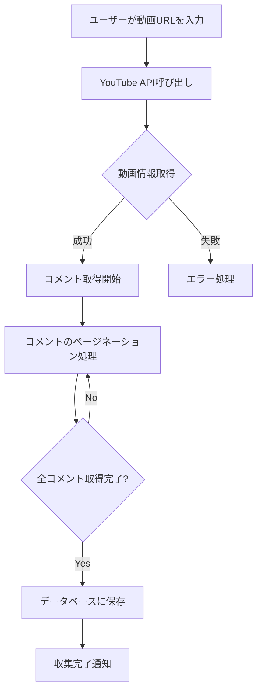
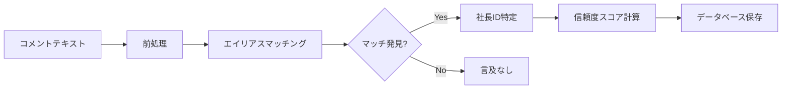
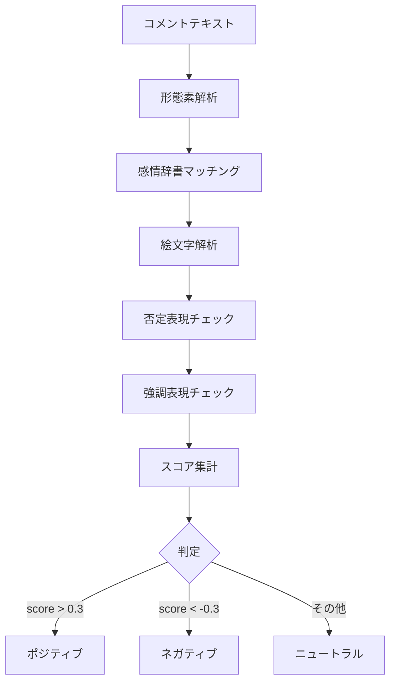

# 🧠 令和の虎分析システム - システムロジック詳細

## 📐 システムアーキテクチャ

### 全体構成

```
┌─────────────────────────────────────────────────────────────┐
│                      フロントエンド (React)                    │
│  ┌──────────┐ ┌──────────┐ ┌──────────┐ ┌──────────┐     │
│  │Dashboard │ │Analysis  │ │Sentiment │ │Reports   │     │
│  └──────────┘ └──────────┘ └──────────┘ └──────────┘     │
└─────────────────────────────────────────────────────────────┘
                              │
                    REST API / WebSocket
                              │
┌─────────────────────────────────────────────────────────────┐
│                    バックエンド (FastAPI)                      │
│  ┌──────────────────────────────────────────────────────┐  │
│  │                  APIレイヤー                            │  │
│  │  - /api/v1/videos    - /api/v1/sentiment             │  │
│  │  - /api/v1/tigers    - /api/v1/wordcloud            │  │
│  │  - /api/v1/analysis  - /api/v1/comparison           │  │
│  └──────────────────────────────────────────────────────┘  │
│  ┌──────────────────────────────────────────────────────┐  │
│  │                  ビジネスロジック層                      │  │
│  │  - CommentAnalyzer   - SentimentAnalyzer            │  │
│  │  - TigerManager      - WordCloudGenerator           │  │
│  │  - StatsAggregator   - ReportGenerator              │  │
│  └──────────────────────────────────────────────────────┘  │
│  ┌──────────────────────────────────────────────────────┐  │
│  │                  データアクセス層                        │  │
│  │  - SQLAlchemy ORM    - Redis Cache                  │  │
│  │  - Database Models   - YouTube API Client           │  │
│  └──────────────────────────────────────────────────────┘  │
└─────────────────────────────────────────────────────────────┘
                              │
                ┌──────────────┴──────────────┐
                │                              │
        ┌──────────────┐            ┌──────────────┐
        │  PostgreSQL  │            │    Redis     │
        │   Database   │            │    Cache     │
        └──────────────┘            └──────────────┘
```

## 🔄 処理フローとロジック

### 1. データ収集フロー



#### 詳細ロジック：

1. **動画情報取得** (`collectors/youtube_collector.py`)
   ```python
   # YouTube APIから動画メタデータを取得
   video_response = youtube.videos().list(
       part="snippet,statistics",
       id=video_id
   ).execute()
   ```

2. **コメント収集**
   - ページトークンを使用した再帰的取得
   - 返信コメントも含めて完全取得
   - APIクォータ管理（10,000 units/day）
   - エラー時の自動リトライ（最大3回）

3. **データ正規化**
   - UTF-8エンコーディング
   - HTMLエンティティのデコード
   - 改行・空白の統一

### 2. 社長言及判定ロジック



#### 判定アルゴリズム：

```python
def analyze_comment(comment_text: str) -> List[TigerMention]:
    """
    コメントから社長言及を判定するコアロジック
    """
    mentions = []
    normalized_text = normalize_text(comment_text)

    # 1. 完全一致チェック（優先度: 高）
    for tiger in tigers:
        for alias in tiger.aliases:
            if alias.type == "primary":
                if exact_match(normalized_text, alias.name):
                    mentions.append(TigerMention(
                        tiger_id=tiger.id,
                        confidence=1.0,
                        match_type="exact"
                    ))

    # 2. 部分一致チェック（優先度: 中）
    if not mentions:
        for tiger in tigers:
            for alias in tiger.aliases:
                if alias.type == "nickname":
                    if partial_match(normalized_text, alias.name):
                        # コンテキストチェック
                        if check_context(normalized_text, alias.name):
                            mentions.append(TigerMention(
                                tiger_id=tiger.id,
                                confidence=0.8,
                                match_type="partial"
                            ))

    # 3. 曖昧な表現の処理（優先度: 低）
    if not mentions:
        if contains_ambiguous_reference(normalized_text):
            # 文脈から推定
            tiger_id = infer_from_context(normalized_text, video_context)
            if tiger_id:
                mentions.append(TigerMention(
                    tiger_id=tiger_id,
                    confidence=0.6,
                    match_type="contextual"
                ))

    return mentions
```

#### エイリアス優先度：

1. **本名完全形** (林尚弘) - 優先度: 100
2. **敬称付き姓** (林社長) - 優先度: 90
3. **会社名付き** (モビリティーランドの林) - 優先度: 85
4. **ニックネーム** (FC社長) - 優先度: 70
5. **姓のみ** (林) - 優先度: 50（文脈チェック必須）

### 3. 感情分析ロジック



#### 感情判定アルゴリズム：

```python
class SentimentAnalyzer:
    def analyze(self, text: str) -> SentimentResult:
        score = 0.0

        # 1. 辞書ベース判定
        for word in self.positive_words:
            if word in text:
                score += self.positive_weights[word]

        for word in self.negative_words:
            if word in text:
                score -= self.negative_weights[word]

        # 2. 絵文字判定
        for emoji in extract_emojis(text):
            if emoji in self.positive_emojis:
                score += 0.5
            elif emoji in self.negative_emojis:
                score -= 0.5

        # 3. 否定表現の反転
        if has_negation(text):
            score = -score * 0.8

        # 4. 強調表現の増幅
        if has_emphasis(text):  # "すごく", "とても", "！！"
            score = score * 1.5

        # 5. 最終判定
        if score > 0.3:
            return SentimentResult(label="positive", score=score)
        elif score < -0.3:
            return SentimentResult(label="negative", score=score)
        else:
            return SentimentResult(label="neutral", score=score)
```

### 4. 統計集計ロジック

#### Rate_total（絶対的存在感）の計算：

```python
def calculate_rate_total(tiger_id: str, video_id: str) -> float:
    """
    動画全体におけるその社長の存在感を計算
    """
    # その社長に言及したコメント数
    tiger_mentions = db.query(CommentTigerRelation)\
        .filter_by(tiger_id=tiger_id, video_id=video_id)\
        .count()

    # 動画の総コメント数
    total_comments = db.query(Comment)\
        .filter_by(video_id=video_id)\
        .count()

    if total_comments == 0:
        return 0.0

    return (tiger_mentions / total_comments) * 100
```

#### Rate_entity（相対的主役度）の計算：

```python
def calculate_rate_entity(tiger_id: str, video_id: str) -> float:
    """
    社長関連コメント内でのその社長の割合を計算
    """
    # その社長に言及したコメント数
    tiger_mentions = db.query(CommentTigerRelation)\
        .filter_by(tiger_id=tiger_id, video_id=video_id)\
        .count()

    # 社長に言及した全コメント数（ユニーク）
    tiger_related_comments = db.query(CommentTigerRelation.comment_id)\
        .filter_by(video_id=video_id)\
        .distinct()\
        .count()

    if tiger_related_comments == 0:
        return 0.0

    return (tiger_mentions / tiger_related_comments) * 100
```

### 5. ワードクラウド生成ロジック

```python
def generate_wordcloud(comments: List[str]) -> Dict[str, int]:
    """
    コメントから頻出単語を抽出
    """
    word_freq = {}

    for comment in comments:
        # 1. 形態素解析（簡易版）
        words = simple_tokenize(comment)

        # 2. ストップワード除去
        words = [w for w in words if w not in STOP_WORDS]

        # 3. 品詞フィルタリング（名詞・動詞・形容詞のみ）
        words = filter_by_pos(words, ['名詞', '動詞', '形容詞'])

        # 4. 頻度カウント
        for word in words:
            if len(word) >= 2:  # 2文字以上
                word_freq[word] = word_freq.get(word, 0) + 1

    # 5. TF-IDF重み付け（オプション）
    if use_tfidf:
        word_freq = apply_tfidf_weights(word_freq, all_documents)

    # 6. 上位N件を返す
    return dict(sorted(word_freq.items(),
                      key=lambda x: x[1],
                      reverse=True)[:100])
```

### 6. リアルタイム更新ロジック（WebSocket）

```python
class WebSocketManager:
    async def periodic_update(self):
        """
        10秒ごとに統計情報を更新
        """
        while True:
            # 1. 最新統計を取得
            stats = await get_realtime_stats()

            # 2. 全接続クライアントに送信
            for connection in self.active_connections:
                await connection.send_json({
                    "type": "stats_update",
                    "data": {
                        "total_videos": stats.total_videos,
                        "total_comments": stats.total_comments,
                        "top_tigers": stats.top_tigers[:5],
                        "latest_analysis": stats.latest_analysis,
                        "timestamp": datetime.now().isoformat()
                    }
                })

            # 3. 10秒待機
            await asyncio.sleep(10)
```

### 7. キャッシュ戦略

```python
class CacheManager:
    def get_or_compute(self, key: str, compute_func, ttl: int = 300):
        """
        キャッシュから取得、なければ計算して保存
        """
        # 1. Redisから取得試行
        if self.redis_client:
            cached = self.redis_client.get(key)
            if cached:
                return json.loads(cached)

        # 2. キャッシュミス時は計算
        result = compute_func()

        # 3. 結果をキャッシュ
        if self.redis_client:
            self.redis_client.setex(
                key,
                ttl,
                json.dumps(result, ensure_ascii=False)
            )
        else:
            # フォールバック：インメモリキャッシュ
            self.memory_cache[key] = {
                'data': result,
                'expires_at': time.time() + ttl
            }

        return result
```

### 8. 比較分析ロジック

#### パフォーマンススコア計算：

```python
def calculate_performance_score(tiger_stats: TigerStats) -> float:
    """
    社長の総合パフォーマンススコアを計算
    """
    # 重み付け係数
    weights = {
        'mentions': 0.3,      # 言及数の重要度
        'rate_total': 0.2,    # 絶対的存在感
        'rate_entity': 0.2,   # 相対的主役度
        'sentiment': 0.2,     # 感情スコア
        'growth': 0.1         # 成長率
    }

    # 正規化
    normalized = {
        'mentions': tiger_stats.total_mentions / max_mentions,
        'rate_total': tiger_stats.avg_rate_total / 100,
        'rate_entity': tiger_stats.avg_rate_entity / 100,
        'sentiment': (tiger_stats.sentiment_score + 100) / 200,
        'growth': (tiger_stats.growth_rate + 100) / 200
    }

    # 加重平均
    score = sum(
        normalized[key] * weights[key]
        for key in weights
    )

    return score * 100  # 0-100スケール
```

## 🔐 セキュリティロジック

### JWT認証フロー：

```python
def authenticate_user(username: str, password: str) -> Optional[User]:
    # 1. ユーザー検索
    user = db.query(User).filter_by(username=username).first()
    if not user:
        return None

    # 2. パスワード検証（bcrypt）
    if not verify_password(password, user.hashed_password):
        return None

    # 3. JWTトークン生成
    payload = {
        "sub": user.id,
        "exp": datetime.utcnow() + timedelta(hours=24),
        "iat": datetime.utcnow()
    }
    token = jwt.encode(payload, SECRET_KEY, algorithm="HS256")

    return {"access_token": token, "token_type": "bearer"}
```

## 🎯 パフォーマンス最適化

### 1. データベースインデックス：

```sql
-- 頻繁に検索される列にインデックス
CREATE INDEX idx_comments_video_id ON comments(video_id);
CREATE INDEX idx_comment_tiger_relations_tiger_id ON comment_tiger_relations(tiger_id);
CREATE INDEX idx_comment_tiger_relations_video_id ON comment_tiger_relations(video_id);
CREATE INDEX idx_video_tiger_stats_composite ON video_tiger_stats(video_id, tiger_id);
```

### 2. N+1問題の回避：

```python
# ❌ 悪い例：N+1問題
videos = db.query(Video).all()
for video in videos:
    # 各ビデオごとにクエリ発行
    stats = db.query(VideoTigerStats).filter_by(video_id=video.id).all()

# ✅ 良い例：Eager Loading
videos = db.query(Video)\
    .options(joinedload(Video.tiger_stats))\
    .all()
```

### 3. バッチ処理：

```python
def batch_insert_comments(comments: List[Dict], batch_size: int = 1000):
    """
    大量コメントの効率的な挿入
    """
    for i in range(0, len(comments), batch_size):
        batch = comments[i:i + batch_size]
        db.bulk_insert_mappings(Comment, batch)
        db.commit()
```

## 📊 エラー処理とリカバリー

### YouTube API エラー処理：

```python
def safe_api_call(api_func, max_retries=3):
    """
    APIエラーの自動リトライ
    """
    for attempt in range(max_retries):
        try:
            return api_func()
        except HttpError as e:
            if e.resp.status == 403:  # クォータ超過
                if attempt < max_retries - 1:
                    wait_time = 2 ** attempt * 60  # 指数バックオフ
                    time.sleep(wait_time)
                else:
                    raise QuotaExceededException()
            elif e.resp.status == 404:  # 動画が見つからない
                raise VideoNotFoundException()
            else:
                raise
```

## 🔄 データ同期戦略

### キャッシュ無効化：

```python
def invalidate_related_caches(video_id: str):
    """
    関連するすべてのキャッシュを無効化
    """
    patterns_to_delete = [
        f"video_stats:{video_id}",
        f"video_ranking:*",
        f"tiger_stats:*:{video_id}",
        f"wordcloud:{video_id}",
        f"sentiment:{video_id}"
    ]

    for pattern in patterns_to_delete:
        for key in redis_client.scan_iter(match=pattern):
            redis_client.delete(key)
```

## 📈 スケーラビリティ考慮事項

### 水平スケーリング対応：

1. **ステートレス設計**: セッション情報はRedisで管理
2. **キュー処理**: Celeryによる非同期タスク処理（将来実装）
3. **ロードバランサー**: nginx/HAProxyでの負荷分散
4. **データベース**: Read Replicaの利用可能

### 垂直スケーリング対応：

1. **コネクションプーリング**: SQLAlchemy pool_size設定
2. **メモリ最適化**: ジェネレータ使用で大量データ処理
3. **並列処理**: asyncio/ThreadPoolExecutor活用

---

このドキュメントは令和の虎分析システムの内部ロジックを詳細に説明しています。
各機能の実装詳細については、対応するソースコードを参照してください。